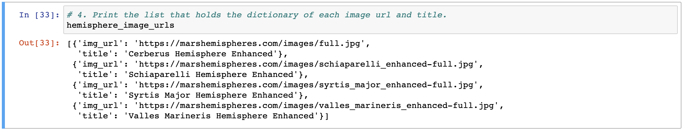
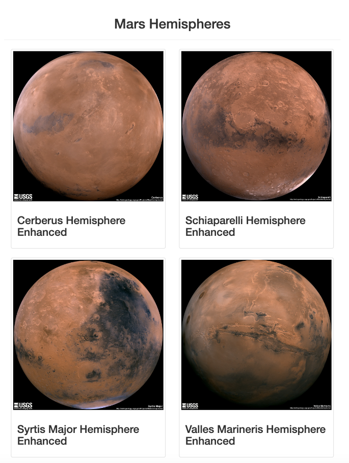
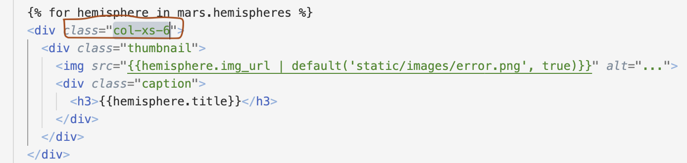
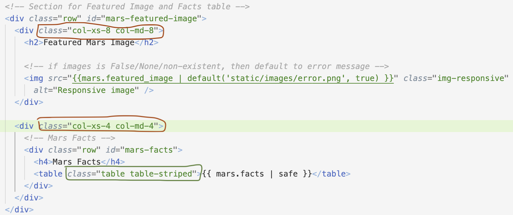
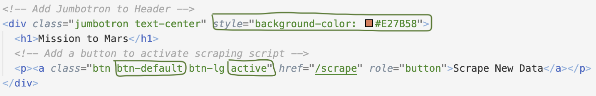

# Mission-to-Mars

A web scraping project to extract data online about the planet, Mars.

## Overview

The project aims to help a junior data scientist write a Python script that would gather all the information she searches into one convenient location. Once gathered, she wants to show it off to other astrophiles. The tasks that need attention are listed below:
- Use HTML elements and CSS styles with class and id attributes, to identify content for web scraping.
- Use BeautifulSoup and Splinter to automate a web browser and perform a web scrape:
  - Retrieve Mars data along with full-resolution Mars hemisphere images and titles.
- Create a MongoDB database to store data from the web scrape.
- Create a web application with Flask to display the data along with Mars hemisphere images from the web scrape.
- Use Bootstrap components to polish and customize the web page.

## Resources

- Anaconda3_2022.05
- Conda 4.14.0
- Jupyter Notebook 6.4.8
- Python 3.7.10
- Pandas 1.3.5
- Splinter-0.18.1
- Webdriver-manager-3.8.3
- Beautiful Soup 4-0.0.1
- MongoDB 6.0 
- Pymongo-4.2.0
- Flask 2.2.3
- Flask-PyMongo-2.3.0
- Html5lib-1.1
- Bootstrap 3

## Results
- To automate the browser and perform web scrape, BeautifulSoup and Splinter are used. The news, facts, space and hemisphere images about Mars are scraped from different sites and are stored in MongoDB. The code to perform web scrape and database storage is stored in a python script. Below is the example of data retrieved.

- A web application with Flask is created to display the data. 

- Bootstrap 3 classes are added to make the web page mobile-responsive.

<table>
  <tr>
    <td></td>
    <td></td>
  </tr>
</table>
- More Bootstrap classes are added to customize the look and feel of the web page as shown below:

